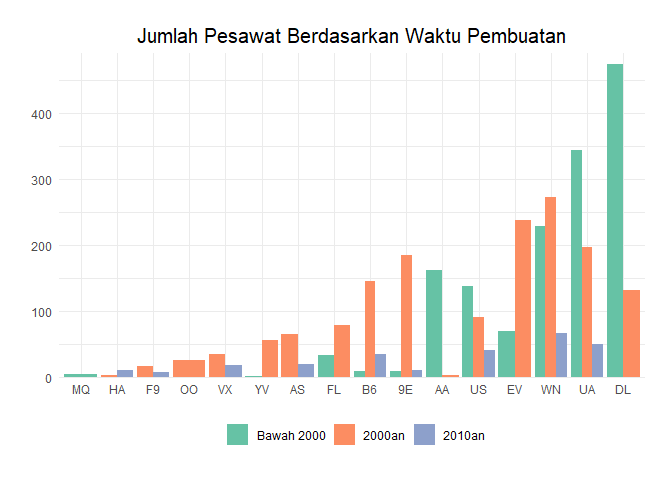

# Data Wrangling and Analysis - Tugas Komstat

## Import Library dan Deklarasi Function


``` r
library(dplyr)
library(ggplot2)
library(nycflights13)
library(lubridate)
library(corrplot)
library(reshape2)
library(knitr)
```

### Fungsi `cekNa`

Fungsi ini berguna untuk menghitung jumlah NA pada setiap kolom

``` r
cekNa <- function (data){
      sapply(data, function(x) sum(is.na(x)))      
}
```

### Fungsi `convertToDate`

Fungsi ini berguna untuk menggabungkan tanggal yang terpisah

``` r
convertToDate <- function(year, month, day, hour_minute){
      ymd_hm(paste(paste(year, month, day, sep = "-"), 
                   paste(floor(hour_minute / 100), hour_minute %% 100, sep = ":")))
}
```

## Data Cleaning dan Integration


Flight data merupakan data penerbangan dari tanggal 1 Januari 2013
sampai 31 Desember 2013 di 3 bandara yang ada di New York City, yaitu
Bandara International John F Kennedy (JFK), Bandara La Guardia (LGA) dan
Bandara International Newark Liberty (EWR). Data ini berasal dari
library
[`nycflights13`](https://cran.r-project.org/web/packages/nycflights13/nycflights13.pdf).

``` r
data("flights")
kable(sample_n(flights, 5))
```

<table>
<colgroup>
<col style="width: 2%" />
<col style="width: 3%" />
<col style="width: 2%" />
<col style="width: 5%" />
<col style="width: 8%" />
<col style="width: 5%" />
<col style="width: 5%" />
<col style="width: 8%" />
<col style="width: 5%" />
<col style="width: 4%" />
<col style="width: 4%" />
<col style="width: 4%" />
<col style="width: 4%" />
<col style="width: 2%" />
<col style="width: 5%" />
<col style="width: 5%" />
<col style="width: 2%" />
<col style="width: 4%" />
<col style="width: 11%" />
</colgroup>
<thead>
<tr class="header">
<th style="text-align: right;">year</th>
<th style="text-align: right;">month</th>
<th style="text-align: right;">day</th>
<th style="text-align: right;">dep_time</th>
<th style="text-align: right;">sched_dep_time</th>
<th style="text-align: right;">dep_delay</th>
<th style="text-align: right;">arr_time</th>
<th style="text-align: right;">sched_arr_time</th>
<th style="text-align: right;">arr_delay</th>
<th style="text-align: left;">carrier</th>
<th style="text-align: right;">flight</th>
<th style="text-align: left;">tailnum</th>
<th style="text-align: left;">origin</th>
<th style="text-align: left;">dest</th>
<th style="text-align: right;">air_time</th>
<th style="text-align: right;">distance</th>
<th style="text-align: right;">hour</th>
<th style="text-align: right;">minute</th>
<th style="text-align: left;">time_hour</th>
</tr>
</thead>
<tbody>
<tr class="odd">
<td style="text-align: right;">2013</td>
<td style="text-align: right;">8</td>
<td style="text-align: right;">25</td>
<td style="text-align: right;">2242</td>
<td style="text-align: right;">2245</td>
<td style="text-align: right;">-3</td>
<td style="text-align: right;">2335</td>
<td style="text-align: right;">2359</td>
<td style="text-align: right;">-24</td>
<td style="text-align: left;">B6</td>
<td style="text-align: right;">1816</td>
<td style="text-align: left;">N368JB</td>
<td style="text-align: left;">JFK</td>
<td style="text-align: left;">SYR</td>
<td style="text-align: right;">42</td>
<td style="text-align: right;">209</td>
<td style="text-align: right;">22</td>
<td style="text-align: right;">45</td>
<td style="text-align: left;">2013-08-25 22:00:00</td>
</tr>
<tr class="even">
<td style="text-align: right;">2013</td>
<td style="text-align: right;">10</td>
<td style="text-align: right;">11</td>
<td style="text-align: right;">2344</td>
<td style="text-align: right;">2025</td>
<td style="text-align: right;">199</td>
<td style="text-align: right;">119</td>
<td style="text-align: right;">2228</td>
<td style="text-align: right;">171</td>
<td style="text-align: left;">EV</td>
<td style="text-align: right;">4348</td>
<td style="text-align: left;">N13202</td>
<td style="text-align: left;">EWR</td>
<td style="text-align: left;">MSP</td>
<td style="text-align: right;">138</td>
<td style="text-align: right;">1008</td>
<td style="text-align: right;">20</td>
<td style="text-align: right;">25</td>
<td style="text-align: left;">2013-10-11 20:00:00</td>
</tr>
<tr class="odd">
<td style="text-align: right;">2013</td>
<td style="text-align: right;">2</td>
<td style="text-align: right;">19</td>
<td style="text-align: right;">947</td>
<td style="text-align: right;">855</td>
<td style="text-align: right;">52</td>
<td style="text-align: right;">1316</td>
<td style="text-align: right;">1214</td>
<td style="text-align: right;">62</td>
<td style="text-align: left;">B6</td>
<td style="text-align: right;">1061</td>
<td style="text-align: left;">N284JB</td>
<td style="text-align: left;">JFK</td>
<td style="text-align: left;">AUS</td>
<td style="text-align: right;">239</td>
<td style="text-align: right;">1521</td>
<td style="text-align: right;">8</td>
<td style="text-align: right;">55</td>
<td style="text-align: left;">2013-02-19 08:00:00</td>
</tr>
<tr class="even">
<td style="text-align: right;">2013</td>
<td style="text-align: right;">5</td>
<td style="text-align: right;">19</td>
<td style="text-align: right;">1300</td>
<td style="text-align: right;">1300</td>
<td style="text-align: right;">0</td>
<td style="text-align: right;">1530</td>
<td style="text-align: right;">1610</td>
<td style="text-align: right;">-40</td>
<td style="text-align: left;">VX</td>
<td style="text-align: right;">165</td>
<td style="text-align: left;">N639VA</td>
<td style="text-align: left;">EWR</td>
<td style="text-align: left;">LAX</td>
<td style="text-align: right;">312</td>
<td style="text-align: right;">2454</td>
<td style="text-align: right;">13</td>
<td style="text-align: right;">0</td>
<td style="text-align: left;">2013-05-19 13:00:00</td>
</tr>
<tr class="odd">
<td style="text-align: right;">2013</td>
<td style="text-align: right;">2</td>
<td style="text-align: right;">20</td>
<td style="text-align: right;">2057</td>
<td style="text-align: right;">2005</td>
<td style="text-align: right;">52</td>
<td style="text-align: right;">2312</td>
<td style="text-align: right;">2230</td>
<td style="text-align: right;">42</td>
<td style="text-align: left;">9E</td>
<td style="text-align: right;">4033</td>
<td style="text-align: left;">N8936A</td>
<td style="text-align: left;">LGA</td>
<td style="text-align: left;">TYS</td>
<td style="text-align: right;">107</td>
<td style="text-align: right;">647</td>
<td style="text-align: right;">20</td>
<td style="text-align: right;">5</td>
<td style="text-align: left;">2013-02-20 20:00:00</td>
</tr>
</tbody>
</table>

Pada library `nycflights13` tersedia juga data lainnya yang mendukung
data flight tersebut. 

1. Data weather, yaitu data yang berisi tentang
cuaca pada tiga bandara tersebut selama tahun 2013

``` r
data("weather")
kable(sample_n(weather, 5))
```

<table style="width:100%;">
<colgroup>
<col style="width: 5%" />
<col style="width: 4%" />
<col style="width: 5%" />
<col style="width: 3%" />
<col style="width: 4%" />
<col style="width: 5%" />
<col style="width: 5%" />
<col style="width: 5%" />
<col style="width: 7%" />
<col style="width: 9%" />
<col style="width: 8%" />
<col style="width: 5%" />
<col style="width: 7%" />
<col style="width: 5%" />
<col style="width: 17%" />
</colgroup>
<thead>
<tr class="header">
<th style="text-align: left;">origin</th>
<th style="text-align: right;">year</th>
<th style="text-align: right;">month</th>
<th style="text-align: right;">day</th>
<th style="text-align: right;">hour</th>
<th style="text-align: right;">temp</th>
<th style="text-align: right;">dewp</th>
<th style="text-align: right;">humid</th>
<th style="text-align: right;">wind_dir</th>
<th style="text-align: right;">wind_speed</th>
<th style="text-align: right;">wind_gust</th>
<th style="text-align: right;">precip</th>
<th style="text-align: right;">pressure</th>
<th style="text-align: right;">visib</th>
<th style="text-align: left;">time_hour</th>
</tr>
</thead>
<tbody>
<tr class="odd">
<td style="text-align: left;">JFK</td>
<td style="text-align: right;">2013</td>
<td style="text-align: right;">11</td>
<td style="text-align: right;">28</td>
<td style="text-align: right;">14</td>
<td style="text-align: right;">35.96</td>
<td style="text-align: right;">6.98</td>
<td style="text-align: right;">29.29</td>
<td style="text-align: right;">320</td>
<td style="text-align: right;">13.80936</td>
<td style="text-align: right;">NA</td>
<td style="text-align: right;">0</td>
<td style="text-align: right;">1026.0</td>
<td style="text-align: right;">10</td>
<td style="text-align: left;">2013-11-28 14:00:00</td>
</tr>
<tr class="even">
<td style="text-align: left;">LGA</td>
<td style="text-align: right;">2013</td>
<td style="text-align: right;">7</td>
<td style="text-align: right;">24</td>
<td style="text-align: right;">4</td>
<td style="text-align: right;">78.98</td>
<td style="text-align: right;">66.02</td>
<td style="text-align: right;">64.54</td>
<td style="text-align: right;">0</td>
<td style="text-align: right;">0.00000</td>
<td style="text-align: right;">NA</td>
<td style="text-align: right;">0</td>
<td style="text-align: right;">1002.7</td>
<td style="text-align: right;">10</td>
<td style="text-align: left;">2013-07-24 04:00:00</td>
</tr>
<tr class="odd">
<td style="text-align: left;">LGA</td>
<td style="text-align: right;">2013</td>
<td style="text-align: right;">9</td>
<td style="text-align: right;">9</td>
<td style="text-align: right;">15</td>
<td style="text-align: right;">71.06</td>
<td style="text-align: right;">48.92</td>
<td style="text-align: right;">45.43</td>
<td style="text-align: right;">NA</td>
<td style="text-align: right;">5.75390</td>
<td style="text-align: right;">NA</td>
<td style="text-align: right;">0</td>
<td style="text-align: right;">1022.6</td>
<td style="text-align: right;">10</td>
<td style="text-align: left;">2013-09-09 15:00:00</td>
</tr>
<tr class="even">
<td style="text-align: left;">LGA</td>
<td style="text-align: right;">2013</td>
<td style="text-align: right;">7</td>
<td style="text-align: right;">8</td>
<td style="text-align: right;">19</td>
<td style="text-align: right;">84.92</td>
<td style="text-align: right;">66.92</td>
<td style="text-align: right;">54.90</td>
<td style="text-align: right;">210</td>
<td style="text-align: right;">16.11092</td>
<td style="text-align: right;">21.86482</td>
<td style="text-align: right;">0</td>
<td style="text-align: right;">1015.2</td>
<td style="text-align: right;">10</td>
<td style="text-align: left;">2013-07-08 19:00:00</td>
</tr>
<tr class="odd">
<td style="text-align: left;">JFK</td>
<td style="text-align: right;">2013</td>
<td style="text-align: right;">8</td>
<td style="text-align: right;">28</td>
<td style="text-align: right;">6</td>
<td style="text-align: right;">71.06</td>
<td style="text-align: right;">68.00</td>
<td style="text-align: right;">90.06</td>
<td style="text-align: right;">90</td>
<td style="text-align: right;">4.60312</td>
<td style="text-align: right;">NA</td>
<td style="text-align: right;">0</td>
<td style="text-align: right;">1012.1</td>
<td style="text-align: right;">9</td>
<td style="text-align: left;">2013-08-28 06:00:00</td>
</tr>
</tbody>
</table>

2.  Data airlines, yaitu data nama maskapai yang melakukan penerbangan
    ditiga bandara tersebut

``` r
data("airlines")
kable(sample_n(airlines, 7))
```

| carrier | name                   |
|:--------|:-----------------------|
| OO      | SkyWest Airlines Inc.  |
| AS      | Alaska Airlines Inc.   |
| HA      | Hawaiian Airlines Inc. |
| B6      | JetBlue Airways        |
| AA      | American Airlines Inc. |
| DL      | Delta Air Lines Inc.   |
| 9E      | Endeavor Air Inc.      |

3.  Data airports, yaitu data mengenai bandara yang ada di America

``` r
data("airports")
kable(sample_n(airports, 5))
```

<table style="width:100%;">
<colgroup>
<col style="width: 4%" />
<col style="width: 39%" />
<col style="width: 9%" />
<col style="width: 11%" />
<col style="width: 5%" />
<col style="width: 3%" />
<col style="width: 4%" />
<col style="width: 21%" />
</colgroup>
<thead>
<tr class="header">
<th style="text-align: left;">faa</th>
<th style="text-align: left;">name</th>
<th style="text-align: right;">lat</th>
<th style="text-align: right;">lon</th>
<th style="text-align: right;">alt</th>
<th style="text-align: right;">tz</th>
<th style="text-align: left;">dst</th>
<th style="text-align: left;">tzone</th>
</tr>
</thead>
<tbody>
<tr class="odd">
<td style="text-align: left;">WSX</td>
<td style="text-align: left;">Westsound Seaplane Base</td>
<td style="text-align: right;">48.61778</td>
<td style="text-align: right;">-122.95278</td>
<td style="text-align: right;">0</td>
<td style="text-align: right;">-8</td>
<td style="text-align: left;">A</td>
<td style="text-align: left;">America/Los_Angeles</td>
</tr>
<tr class="even">
<td style="text-align: left;">HYA</td>
<td style="text-align: left;">Barnstable Muni Boardman Polando Fld</td>
<td style="text-align: right;">41.66934</td>
<td style="text-align: right;">-70.28036</td>
<td style="text-align: right;">55</td>
<td style="text-align: right;">-5</td>
<td style="text-align: left;">A</td>
<td style="text-align: left;">America/New_York</td>
</tr>
<tr class="odd">
<td style="text-align: left;">AKB</td>
<td style="text-align: left;">Atka Airport</td>
<td style="text-align: right;">52.22028</td>
<td style="text-align: right;">-174.20639</td>
<td style="text-align: right;">56</td>
<td style="text-align: right;">-9</td>
<td style="text-align: left;">A</td>
<td style="text-align: left;">America/Anchorage</td>
</tr>
<tr class="even">
<td style="text-align: left;">IKR</td>
<td style="text-align: left;">Kirtland Air Force Base</td>
<td style="text-align: right;">35.04022</td>
<td style="text-align: right;">-106.60919</td>
<td style="text-align: right;">5355</td>
<td style="text-align: right;">-7</td>
<td style="text-align: left;">A</td>
<td style="text-align: left;">America/Denver</td>
</tr>
<tr class="odd">
<td style="text-align: left;">PEC</td>
<td style="text-align: left;">Pelican Seaplane Base</td>
<td style="text-align: right;">57.95528</td>
<td style="text-align: right;">-136.23639</td>
<td style="text-align: right;">0</td>
<td style="text-align: right;">-9</td>
<td style="text-align: left;">A</td>
<td style="text-align: left;">America/Anchorage</td>
</tr>
</tbody>
</table>

4.  Data planes, yaitu data mengenai pesawat yang melakukan penerbangan
    ditiga bandara tersebut

``` r
data("planes")
kable(sample_n(airports, 5))
```

| faa | name                    |       lat|         lon|  alt|   tz| dst | tzone                |
|:----|:------------------------|---------:|-----------:|----:|----:|:----|:---------------------|
| AKB | Atka Airport            |  52.22028|  -174.20639|   56|   -9| A   | America/Anchorage    |
| EET | Shelby County Airport   |  33.17778|   -86.78322|  586|   -6| A   | America/Chicago      |
| FNT | Bishop International    |  42.96542|   -83.74363|  782|   -5| A   | America/New\_York    |
| CYM | Chatham Seaplane Base   |  57.51500|  -134.94611|    0|   -9| A   | America/Anchorage    |
| TOA | Zamperini Field Airport |  33.80339|  -118.33961|  101|   -8| A   | America/Los\_Angeles |

### Menghapus data yang tidak legkap

``` r
cekNa(flights)
```

    ##           year          month            day       dep_time sched_dep_time 
    ##              0              0              0           8255              0 
    ##      dep_delay       arr_time sched_arr_time      arr_delay        carrier 
    ##           8255           8713              0           9430              0 
    ##         flight        tailnum         origin           dest       air_time 
    ##              0           2512              0              0           9430 
    ##       distance           hour         minute      time_hour 
    ##              0              0              0              0

Terlihat bahwa 6 kolom yang masih mengandung NA. Agar memudahkan
analisis maka data tersebut akan dihilangkan

``` r
data <- na.omit(flights)
cekNa(data)
```

    ##           year          month            day       dep_time sched_dep_time 
    ##              0              0              0              0              0 
    ##      dep_delay       arr_time sched_arr_time      arr_delay        carrier 
    ##              0              0              0              0              0 
    ##         flight        tailnum         origin           dest       air_time 
    ##              0              0              0              0              0 
    ##       distance           hour         minute      time_hour 
    ##              0              0              0              0

### Menghapus kolom yang tidak diperlukan

``` r
data <- data %>%
      select(-c(arr_time, sched_arr_time, flight, air_time, minute)) %>%
      mutate(sched_dep_time = convertToDate(2013, month, day, sched_dep_time),
             dep_time = sched_dep_time + dep_delay * 60) 
kable(sample_n(data, 5))
```

<table>
<colgroup>
<col style="width: 3%" />
<col style="width: 4%" />
<col style="width: 2%" />
<col style="width: 14%" />
<col style="width: 14%" />
<col style="width: 7%" />
<col style="width: 7%" />
<col style="width: 5%" />
<col style="width: 5%" />
<col style="width: 5%" />
<col style="width: 3%" />
<col style="width: 6%" />
<col style="width: 3%" />
<col style="width: 14%" />
</colgroup>
<thead>
<tr class="header">
<th style="text-align: right;">year</th>
<th style="text-align: right;">month</th>
<th style="text-align: right;">day</th>
<th style="text-align: left;">dep_time</th>
<th style="text-align: left;">sched_dep_time</th>
<th style="text-align: right;">dep_delay</th>
<th style="text-align: right;">arr_delay</th>
<th style="text-align: left;">carrier</th>
<th style="text-align: left;">tailnum</th>
<th style="text-align: left;">origin</th>
<th style="text-align: left;">dest</th>
<th style="text-align: right;">distance</th>
<th style="text-align: right;">hour</th>
<th style="text-align: left;">time_hour</th>
</tr>
</thead>
<tbody>
<tr class="odd">
<td style="text-align: right;">2013</td>
<td style="text-align: right;">2</td>
<td style="text-align: right;">23</td>
<td style="text-align: left;">2013-02-23 19:52:00</td>
<td style="text-align: left;">2013-02-23 20:00:00</td>
<td style="text-align: right;">-8</td>
<td style="text-align: right;">30</td>
<td style="text-align: left;">B6</td>
<td style="text-align: left;">N646JB</td>
<td style="text-align: left;">JFK</td>
<td style="text-align: left;">PBI</td>
<td style="text-align: right;">1028</td>
<td style="text-align: right;">20</td>
<td style="text-align: left;">2013-02-23 20:00:00</td>
</tr>
<tr class="even">
<td style="text-align: right;">2013</td>
<td style="text-align: right;">3</td>
<td style="text-align: right;">4</td>
<td style="text-align: left;">2013-03-04 06:07:00</td>
<td style="text-align: left;">2013-03-04 06:15:00</td>
<td style="text-align: right;">-8</td>
<td style="text-align: right;">-41</td>
<td style="text-align: left;">US</td>
<td style="text-align: left;">N700UW</td>
<td style="text-align: left;">JFK</td>
<td style="text-align: left;">CLT</td>
<td style="text-align: right;">541</td>
<td style="text-align: right;">6</td>
<td style="text-align: left;">2013-03-04 06:00:00</td>
</tr>
<tr class="odd">
<td style="text-align: right;">2013</td>
<td style="text-align: right;">5</td>
<td style="text-align: right;">28</td>
<td style="text-align: left;">2013-05-28 19:57:00</td>
<td style="text-align: left;">2013-05-28 20:00:00</td>
<td style="text-align: right;">-3</td>
<td style="text-align: right;">-1</td>
<td style="text-align: left;">DL</td>
<td style="text-align: left;">N963DL</td>
<td style="text-align: left;">LGA</td>
<td style="text-align: left;">ATL</td>
<td style="text-align: right;">762</td>
<td style="text-align: right;">20</td>
<td style="text-align: left;">2013-05-28 20:00:00</td>
</tr>
<tr class="even">
<td style="text-align: right;">2013</td>
<td style="text-align: right;">8</td>
<td style="text-align: right;">11</td>
<td style="text-align: left;">2013-08-11 17:12:00</td>
<td style="text-align: left;">2013-08-11 17:15:00</td>
<td style="text-align: right;">-3</td>
<td style="text-align: right;">8</td>
<td style="text-align: left;">EV</td>
<td style="text-align: left;">N13550</td>
<td style="text-align: left;">EWR</td>
<td style="text-align: left;">CVG</td>
<td style="text-align: right;">569</td>
<td style="text-align: right;">17</td>
<td style="text-align: left;">2013-08-11 17:00:00</td>
</tr>
<tr class="odd">
<td style="text-align: right;">2013</td>
<td style="text-align: right;">8</td>
<td style="text-align: right;">28</td>
<td style="text-align: left;">2013-08-28 06:28:00</td>
<td style="text-align: left;">2013-08-28 06:11:00</td>
<td style="text-align: right;">17</td>
<td style="text-align: right;">13</td>
<td style="text-align: left;">B6</td>
<td style="text-align: left;">N506JB</td>
<td style="text-align: left;">JFK</td>
<td style="text-align: left;">SJU</td>
<td style="text-align: right;">1598</td>
<td style="text-align: right;">6</td>
<td style="text-align: left;">2013-08-28 06:00:00</td>
</tr>
</tbody>
</table>

### Integrasi dengan dataset lainnya

Saya menggabungkan 4 dataset dengan data flights ini, data yang
digabungkan adalah kolom yang akan digunakan untuk melakukan analisis
kedepannya.

``` r
data <- data %>%
            left_join(select(weather, -c(dewp, wind_dir, wind_gust, precip)), 
                      by = c("origin", "time_hour", "month", "day", "year", "hour")) %>%
            left_join(select(airports, faa, name), 
                      by = c("origin" = "faa")) %>%
            select(-year) %>%
            rename(dep_airport = name) %>%
            left_join(select(airports, faa, name),
                      by = c("dest" = "faa")) %>%
            rename(dest_airport = name) %>%
            left_join(select(planes, tailnum, year, engine), 
                      by = "tailnum") %>%
            rename(year_aiplane = year) %>%
            left_join(airlines, by = "carrier")
kable(sample_n(data, 5))
```

<table style="width:100%;">
<colgroup>
<col style="width: 2%" />
<col style="width: 1%" />
<col style="width: 7%" />
<col style="width: 7%" />
<col style="width: 3%" />
<col style="width: 3%" />
<col style="width: 3%" />
<col style="width: 3%" />
<col style="width: 2%" />
<col style="width: 1%" />
<col style="width: 3%" />
<col style="width: 1%" />
<col style="width: 7%" />
<col style="width: 2%" />
<col style="width: 2%" />
<col style="width: 4%" />
<col style="width: 3%" />
<col style="width: 2%" />
<col style="width: 7%" />
<col style="width: 9%" />
<col style="width: 4%" />
<col style="width: 3%" />
<col style="width: 9%" />
</colgroup>
<thead>
<tr class="header">
<th style="text-align: right;">month</th>
<th style="text-align: right;">day</th>
<th style="text-align: left;">dep_time</th>
<th style="text-align: left;">sched_dep_time</th>
<th style="text-align: right;">dep_delay</th>
<th style="text-align: right;">arr_delay</th>
<th style="text-align: left;">carrier</th>
<th style="text-align: left;">tailnum</th>
<th style="text-align: left;">origin</th>
<th style="text-align: left;">dest</th>
<th style="text-align: right;">distance</th>
<th style="text-align: right;">hour</th>
<th style="text-align: left;">time_hour</th>
<th style="text-align: right;">temp</th>
<th style="text-align: right;">humid</th>
<th style="text-align: right;">wind_speed</th>
<th style="text-align: right;">pressure</th>
<th style="text-align: right;">visib</th>
<th style="text-align: left;">dep_airport</th>
<th style="text-align: left;">dest_airport</th>
<th style="text-align: right;">year_aiplane</th>
<th style="text-align: left;">engine</th>
<th style="text-align: left;">name</th>
</tr>
</thead>
<tbody>
<tr class="odd">
<td style="text-align: right;">7</td>
<td style="text-align: right;">21</td>
<td style="text-align: left;">2013-07-21 07:24:00</td>
<td style="text-align: left;">2013-07-21 07:25:00</td>
<td style="text-align: right;">-1</td>
<td style="text-align: right;">-13</td>
<td style="text-align: left;">WN</td>
<td style="text-align: left;">N459WN</td>
<td style="text-align: left;">EWR</td>
<td style="text-align: left;">BNA</td>
<td style="text-align: right;">748</td>
<td style="text-align: right;">7</td>
<td style="text-align: left;">2013-07-21 07:00:00</td>
<td style="text-align: right;">78.08</td>
<td style="text-align: right;">57.87</td>
<td style="text-align: right;">9.20624</td>
<td style="text-align: right;">1012.5</td>
<td style="text-align: right;">10</td>
<td style="text-align: left;">Newark Liberty Intl</td>
<td style="text-align: left;">Nashville Intl</td>
<td style="text-align: right;">2004</td>
<td style="text-align: left;">Turbo-fan</td>
<td style="text-align: left;">Southwest Airlines Co.</td>
</tr>
<tr class="even">
<td style="text-align: right;">3</td>
<td style="text-align: right;">25</td>
<td style="text-align: left;">2013-03-25 08:14:00</td>
<td style="text-align: left;">2013-03-25 08:20:00</td>
<td style="text-align: right;">-6</td>
<td style="text-align: right;">-30</td>
<td style="text-align: left;">MQ</td>
<td style="text-align: left;">N534MQ</td>
<td style="text-align: left;">LGA</td>
<td style="text-align: left;">BNA</td>
<td style="text-align: right;">764</td>
<td style="text-align: right;">8</td>
<td style="text-align: left;">2013-03-25 08:00:00</td>
<td style="text-align: right;">39.92</td>
<td style="text-align: right;">57.33</td>
<td style="text-align: right;">17.26170</td>
<td style="text-align: right;">1003.0</td>
<td style="text-align: right;">10</td>
<td style="text-align: left;">La Guardia</td>
<td style="text-align: left;">Nashville Intl</td>
<td style="text-align: right;">NA</td>
<td style="text-align: left;">NA</td>
<td style="text-align: left;">Envoy Air</td>
</tr>
<tr class="odd">
<td style="text-align: right;">3</td>
<td style="text-align: right;">14</td>
<td style="text-align: left;">2013-03-14 15:03:00</td>
<td style="text-align: left;">2013-03-14 15:07:00</td>
<td style="text-align: right;">-4</td>
<td style="text-align: right;">15</td>
<td style="text-align: left;">B6</td>
<td style="text-align: left;">N789JB</td>
<td style="text-align: left;">JFK</td>
<td style="text-align: left;">SJU</td>
<td style="text-align: right;">1598</td>
<td style="text-align: right;">15</td>
<td style="text-align: left;">2013-03-14 15:00:00</td>
<td style="text-align: right;">39.92</td>
<td style="text-align: right;">27.42</td>
<td style="text-align: right;">20.71404</td>
<td style="text-align: right;">1011.3</td>
<td style="text-align: right;">10</td>
<td style="text-align: left;">John F Kennedy Intl</td>
<td style="text-align: left;">NA</td>
<td style="text-align: right;">2011</td>
<td style="text-align: left;">Turbo-fan</td>
<td style="text-align: left;">JetBlue Airways</td>
</tr>
<tr class="even">
<td style="text-align: right;">12</td>
<td style="text-align: right;">22</td>
<td style="text-align: left;">2013-12-22 13:25:00</td>
<td style="text-align: left;">2013-12-22 12:05:00</td>
<td style="text-align: right;">80</td>
<td style="text-align: right;">69</td>
<td style="text-align: left;">EV</td>
<td style="text-align: left;">N48901</td>
<td style="text-align: left;">EWR</td>
<td style="text-align: left;">SAV</td>
<td style="text-align: right;">708</td>
<td style="text-align: right;">12</td>
<td style="text-align: left;">2013-12-22 12:00:00</td>
<td style="text-align: right;">69.98</td>
<td style="text-align: right;">65.54</td>
<td style="text-align: right;">12.65858</td>
<td style="text-align: right;">1012.2</td>
<td style="text-align: right;">10</td>
<td style="text-align: left;">Newark Liberty Intl</td>
<td style="text-align: left;">Savannah Hilton Head Intl</td>
<td style="text-align: right;">2001</td>
<td style="text-align: left;">Turbo-fan</td>
<td style="text-align: left;">ExpressJet Airlines Inc.</td>
</tr>
<tr class="odd">
<td style="text-align: right;">10</td>
<td style="text-align: right;">10</td>
<td style="text-align: left;">2013-10-10 08:56:00</td>
<td style="text-align: left;">2013-10-10 09:00:00</td>
<td style="text-align: right;">-4</td>
<td style="text-align: right;">-10</td>
<td style="text-align: left;">DL</td>
<td style="text-align: left;">N721TW</td>
<td style="text-align: left;">JFK</td>
<td style="text-align: left;">LAX</td>
<td style="text-align: right;">2475</td>
<td style="text-align: right;">9</td>
<td style="text-align: left;">2013-10-10 09:00:00</td>
<td style="text-align: right;">57.02</td>
<td style="text-align: right;">83.21</td>
<td style="text-align: right;">17.26170</td>
<td style="text-align: right;">1023.1</td>
<td style="text-align: right;">10</td>
<td style="text-align: left;">John F Kennedy Intl</td>
<td style="text-align: left;">Los Angeles Intl</td>
<td style="text-align: right;">1999</td>
<td style="text-align: left;">Turbo-fan</td>
<td style="text-align: left;">Delta Air Lines Inc.</td>
</tr>
</tbody>
</table>

Data yang akan dianalisis lebih lanjut sebanyak *327346 data.*

Soal Nomor 1
------------

Apakah delay pada semua bandara memiliki suatu pola tertentu ataukah
bersifat random? Dengan mengetahui informasi ini dapat membantu kita
memahami apakah ada pola tertentu pada delay atau tidak. Jika ada,
dengan mengetahui pola delay, kita dapat mencoba mengatasi penyebab
sistemik dari delay tersebut. Jika tidak ada, setidaknya kita dapat
mengidentifikasi beberapa anomali yang menyebabkan delay. Kita juga
dapat mengukur kinerja bandara selama 12 bulan.

Yang akan menjadi fokus adalah *delay keberangkatan*. Ada dua jenis
delay. yaitu delay positif adalah jam keberangkatan pesawat lebih lambat
dari yang dijadwalkan sebaliknya delay negatif adalah jam keberangkatan
pesawat lebih cepat dari yang dijadwalkan.

### Identifikasi delay secara keseluruhan

``` r
summary(data$dep_delay)
```

    ##    Min. 1st Qu.  Median    Mean 3rd Qu.    Max. 
    ##  -43.00   -5.00   -2.00   12.56   11.00 1301.00

Terlihat bahwa pada tahun 2013 penerbangan paling cepet berangkat 43
menit dari yang dijadwalkan. Jika diliat dari mediannya yang bernilai
-2, berarti ada lebih dari 50% penerbangan pada tahun 2013 yang terbang
lebih cepat daripada jadwalnya. Jika ditelusuri lebih lanjut ternyata
benar ada 183315 penerbangan yang lebih cepat berangkat dan ada 127745
yang lebih lambat dari yang dijadwalkan

Jika dilihat hasil 5 summarynya terdapat hal yang cukup unik yaitu nilai
mediannya negatif akan tetapi nilai rata-ratanya positif dan berbeda
sangat jauh, Selain itu kuartil 3 nya lebih kecil dari rata-ratanya. Hal
ini disebabkan karena banyaknya delay positif yang masuk ke kategori
outlier. Hal ini terlihat dari blox plot dibawah ini. Bentuk dari
boxplotnya sampai tidak terlihat dengan jelas karena banyaknya nilai
outlier yang positif.

``` r
out <- boxplot.stats(data$dep_delay)$out
outPositif <- sum(out > 0)
outNegatif <- length(out) - outPositif
data %>%
      ggplot(aes(y = dep_delay)) +
      geom_boxplot() +
      labs(title = "Box Plot Delay Keberangkatan",
           subtitle = paste("Jumlah Outlier", length(out)),
           caption = paste(outPositif, "Outlier atas dan", outNegatif, "outlier bawah")) +
      theme_minimal() +
      theme(plot.title = element_text(hjus = 0.5),
            plot.subtitle = element_text(hjus = 0.5))
```


``` r
kable(data[which.max(data$dep_delay), ])
```

<table style="width:100%;">
<colgroup>
<col style="width: 2%" />
<col style="width: 1%" />
<col style="width: 7%" />
<col style="width: 7%" />
<col style="width: 3%" />
<col style="width: 3%" />
<col style="width: 3%" />
<col style="width: 3%" />
<col style="width: 2%" />
<col style="width: 1%" />
<col style="width: 3%" />
<col style="width: 1%" />
<col style="width: 7%" />
<col style="width: 2%" />
<col style="width: 2%" />
<col style="width: 4%" />
<col style="width: 3%" />
<col style="width: 2%" />
<col style="width: 7%" />
<col style="width: 5%" />
<col style="width: 5%" />
<col style="width: 3%" />
<col style="width: 9%" />
</colgroup>
<thead>
<tr class="header">
<th style="text-align: right;">month</th>
<th style="text-align: right;">day</th>
<th style="text-align: left;">dep_time</th>
<th style="text-align: left;">sched_dep_time</th>
<th style="text-align: right;">dep_delay</th>
<th style="text-align: right;">arr_delay</th>
<th style="text-align: left;">carrier</th>
<th style="text-align: left;">tailnum</th>
<th style="text-align: left;">origin</th>
<th style="text-align: left;">dest</th>
<th style="text-align: right;">distance</th>
<th style="text-align: right;">hour</th>
<th style="text-align: left;">time_hour</th>
<th style="text-align: right;">temp</th>
<th style="text-align: right;">humid</th>
<th style="text-align: right;">wind_speed</th>
<th style="text-align: right;">pressure</th>
<th style="text-align: right;">visib</th>
<th style="text-align: left;">dep_airport</th>
<th style="text-align: left;">dest_airport</th>
<th style="text-align: right;">year_aiplane</th>
<th style="text-align: left;">engine</th>
<th style="text-align: left;">name</th>
</tr>
</thead>
<tbody>
<tr class="odd">
<td style="text-align: right;">1</td>
<td style="text-align: right;">9</td>
<td style="text-align: left;">2013-01-10 06:41:00</td>
<td style="text-align: left;">2013-01-09 09:00:00</td>
<td style="text-align: right;">1301</td>
<td style="text-align: right;">1272</td>
<td style="text-align: left;">HA</td>
<td style="text-align: left;">N384HA</td>
<td style="text-align: left;">JFK</td>
<td style="text-align: left;">HNL</td>
<td style="text-align: right;">4983</td>
<td style="text-align: right;">9</td>
<td style="text-align: left;">2013-01-09 09:00:00</td>
<td style="text-align: right;">44.96</td>
<td style="text-align: right;">73.59</td>
<td style="text-align: right;">4.60312</td>
<td style="text-align: right;">1029</td>
<td style="text-align: right;">8</td>
<td style="text-align: left;">John F Kennedy Intl</td>
<td style="text-align: left;">Honolulu Intl</td>
<td style="text-align: right;">2011</td>
<td style="text-align: left;">Turbo-fan</td>
<td style="text-align: left;">Hawaiian Airlines Inc.</td>
</tr>
</tbody>
</table>

Dari 5 summary, terlihat bahwa ada penerbangan yang delay hingga 1301
menit, atau sekitar 21 jam. Delay terlama itu ternyata terjadi pada
tanggal 9 Januari. Penerbangan tersebut adalah penerbangan dari Bandara
John F Kennedy ke Bandara Honolulu. Penerbangan tersebut dijadwalkan
berangkat padad jama 9 pagi akan tetapi baru berhasil berangkat pada
esok harinya jam 6:41 pagi. Maskapai dari penerbangan tersebut adalah
Hawaiian Airlines Inc.

### Melihat delay per bandara keberangkatan

``` r
tapply(data$dep_delay, data$dep_airport, function(x){
      jml <- length(x)
      c(jumlah = jml,
           cepat_berangkat = round(sum(x < 0) / jml * 100, 1) ,
           tepat = round(sum(x == 0)/jml * 100, 1),
           lama_berangkat = round(sum(x > 0) / jml * 100, 1))
})
```

    ## $`John F Kennedy Intl`
    ##          jumlah cepat_berangkat           tepat  lama_berangkat 
    ##        109079.0            55.9             5.7            38.4 
    ## 
    ## $`La Guardia`
    ##          jumlah cepat_berangkat           tepat  lama_berangkat 
    ##        101140.0            62.3             4.6            33.1 
    ## 
    ## $`Newark Liberty Intl`
    ##          jumlah cepat_berangkat           tepat  lama_berangkat 
    ##        117127.0            50.5             4.8            44.7

Terlihat bahwa ditiga bandara tersebut persentasi yang lebih cepat
berangkat selalu lebih besar dari persentasi yang lambar berangkat. Jika
dilihat bandara yang tepat waktu adalah bandara John F Kennedy, sebesar
5.7 persen penerbangannya tepat sesuai dengan yang di jadwalkan,
sedangkan untuk bandara yang paling sering delay adalah bandara Newark
Liberty dengan persentase 44.7 penerbangan delay pada tahun 2013.

``` r
perBandara <- split(data$dep_delay, data$dep_airport)
kable(sapply(perBandara, summary))
```

|         |  John F Kennedy Intl|  La Guardia|  Newark Liberty Intl|
|:--------|--------------------:|-----------:|--------------------:|
| Min.    |            -43.00000|   -33.00000|            -25.00000|
| 1st Qu. |             -5.00000|    -6.00000|             -4.00000|
| Median  |             -1.00000|    -3.00000|             -1.00000|
| Mean    |             12.02361|    10.28658|             15.00911|
| 3rd Qu. |             10.00000|     7.00000|             15.00000|
| Max.    |           1301.00000|   911.00000|           1126.00000|

Telihat bahwa di ketiga bandara tersebu rata-rata waktu delai hanya
sekitar 10-15 menit. Akan tetapi terlihat juga di Bandara La Guardia
terjadi delay terlama selama kurang lebih 15 jam sementara di Newark
Liberty kurang lebih 18 jam. Berikut data penerbangan yang memiliki
waktu delay terlama di setiap bandara.

``` r
maxDelay <- sapply(perBandara, which.max)
kable(data[maxDelay, ])
```

<table>
<colgroup>
<col style="width: 2%" />
<col style="width: 1%" />
<col style="width: 7%" />
<col style="width: 7%" />
<col style="width: 3%" />
<col style="width: 3%" />
<col style="width: 3%" />
<col style="width: 3%" />
<col style="width: 2%" />
<col style="width: 1%" />
<col style="width: 3%" />
<col style="width: 1%" />
<col style="width: 7%" />
<col style="width: 2%" />
<col style="width: 2%" />
<col style="width: 4%" />
<col style="width: 3%" />
<col style="width: 2%" />
<col style="width: 7%" />
<col style="width: 9%" />
<col style="width: 5%" />
<col style="width: 3%" />
<col style="width: 8%" />
</colgroup>
<thead>
<tr class="header">
<th style="text-align: right;">month</th>
<th style="text-align: right;">day</th>
<th style="text-align: left;">dep_time</th>
<th style="text-align: left;">sched_dep_time</th>
<th style="text-align: right;">dep_delay</th>
<th style="text-align: right;">arr_delay</th>
<th style="text-align: left;">carrier</th>
<th style="text-align: left;">tailnum</th>
<th style="text-align: left;">origin</th>
<th style="text-align: left;">dest</th>
<th style="text-align: right;">distance</th>
<th style="text-align: right;">hour</th>
<th style="text-align: left;">time_hour</th>
<th style="text-align: right;">temp</th>
<th style="text-align: right;">humid</th>
<th style="text-align: right;">wind_speed</th>
<th style="text-align: right;">pressure</th>
<th style="text-align: right;">visib</th>
<th style="text-align: left;">dep_airport</th>
<th style="text-align: left;">dest_airport</th>
<th style="text-align: right;">year_aiplane</th>
<th style="text-align: left;">engine</th>
<th style="text-align: left;">name</th>
</tr>
</thead>
<tbody>
<tr class="odd">
<td style="text-align: right;">1</td>
<td style="text-align: right;">3</td>
<td style="text-align: left;">2013-01-03 18:19:00</td>
<td style="text-align: left;">2013-01-03 18:20:00</td>
<td style="text-align: right;">-1</td>
<td style="text-align: right;">-42</td>
<td style="text-align: left;">AA</td>
<td style="text-align: left;">N3DNAA</td>
<td style="text-align: left;">EWR</td>
<td style="text-align: left;">LAX</td>
<td style="text-align: right;">2454</td>
<td style="text-align: right;">18</td>
<td style="text-align: left;">2013-01-03 18:00:00</td>
<td style="text-align: right;">30.92</td>
<td style="text-align: right;">51.38</td>
<td style="text-align: right;">10.35702</td>
<td style="text-align: right;">1019.6</td>
<td style="text-align: right;">10</td>
<td style="text-align: left;">Newark Liberty Intl</td>
<td style="text-align: left;">Los Angeles Intl</td>
<td style="text-align: right;">NA</td>
<td style="text-align: left;">NA</td>
<td style="text-align: left;">American Airlines Inc.</td>
</tr>
<tr class="even">
<td style="text-align: right;">10</td>
<td style="text-align: right;">22</td>
<td style="text-align: left;">2013-10-22 13:55:00</td>
<td style="text-align: left;">2013-10-22 13:55:00</td>
<td style="text-align: right;">0</td>
<td style="text-align: right;">-9</td>
<td style="text-align: left;">WN</td>
<td style="text-align: left;">N733SA</td>
<td style="text-align: left;">EWR</td>
<td style="text-align: left;">PHX</td>
<td style="text-align: right;">2133</td>
<td style="text-align: right;">13</td>
<td style="text-align: left;">2013-10-22 13:00:00</td>
<td style="text-align: right;">64.04</td>
<td style="text-align: right;">53.73</td>
<td style="text-align: right;">12.65858</td>
<td style="text-align: right;">1008.6</td>
<td style="text-align: right;">10</td>
<td style="text-align: left;">Newark Liberty Intl</td>
<td style="text-align: left;">Phoenix Sky Harbor Intl</td>
<td style="text-align: right;">1999</td>
<td style="text-align: left;">Turbo-fan</td>
<td style="text-align: left;">Southwest Airlines Co.</td>
</tr>
<tr class="odd">
<td style="text-align: right;">1</td>
<td style="text-align: right;">4</td>
<td style="text-align: left;">2013-01-04 11:00:00</td>
<td style="text-align: left;">2013-01-04 11:00:00</td>
<td style="text-align: right;">0</td>
<td style="text-align: right;">-49</td>
<td style="text-align: left;">UA</td>
<td style="text-align: left;">N87513</td>
<td style="text-align: left;">EWR</td>
<td style="text-align: left;">SFO</td>
<td style="text-align: right;">2565</td>
<td style="text-align: right;">11</td>
<td style="text-align: left;">2013-01-04 11:00:00</td>
<td style="text-align: right;">37.04</td>
<td style="text-align: right;">47.75</td>
<td style="text-align: right;">20.71404</td>
<td style="text-align: right;">1016.9</td>
<td style="text-align: right;">10</td>
<td style="text-align: left;">Newark Liberty Intl</td>
<td style="text-align: left;">San Francisco Intl</td>
<td style="text-align: right;">2008</td>
<td style="text-align: left;">Turbo-fan</td>
<td style="text-align: left;">United Air Lines Inc.</td>
</tr>
</tbody>
</table>

``` r
data %>%
      select(dep_delay, dep_airport) %>%
      group_by(dep_airport) %>%
      mutate(dep_delay = round(dep_delay / 60)) %>%
      filter(dep_delay != 0) %>%
      count(dep_delay) %>%
      arrange(dep_airport, dep_delay) %>%
      rename(dep_delay_jam = dep_delay) %>%
      kable()
```

| dep\_airport        |  dep\_delay\_jam|      n|
|:--------------------|----------------:|------:|
| John F Kennedy Intl |               -1|      1|
| John F Kennedy Intl |                1|  10154|
| John F Kennedy Intl |                2|   3141|
| John F Kennedy Intl |                3|   1140|
| John F Kennedy Intl |                4|    433|
| John F Kennedy Intl |                5|    159|
| John F Kennedy Intl |                6|     59|
| John F Kennedy Intl |                7|     18|
| John F Kennedy Intl |                8|      6|
| John F Kennedy Intl |                9|      1|
| John F Kennedy Intl |               10|      3|
| John F Kennedy Intl |               11|      2|
| John F Kennedy Intl |               12|      1|
| John F Kennedy Intl |               13|      4|
| John F Kennedy Intl |               14|      3|
| John F Kennedy Intl |               15|      1|
| John F Kennedy Intl |               16|      1|
| John F Kennedy Intl |               17|      2|
| John F Kennedy Intl |               19|      1|
| John F Kennedy Intl |               22|      1|
| La Guardia          |               -1|      2|
| La Guardia          |                1|   8639|
| La Guardia          |                2|   2557|
| La Guardia          |                3|   1040|
| La Guardia          |                4|    440|
| La Guardia          |                5|    211|
| La Guardia          |                6|     85|
| La Guardia          |                7|     31|
| La Guardia          |                8|     15|
| La Guardia          |                9|      3|
| La Guardia          |               10|      4|
| La Guardia          |               11|      2|
| La Guardia          |               12|      1|
| La Guardia          |               13|      4|
| La Guardia          |               14|      2|
| La Guardia          |               15|      2|
| Newark Liberty Intl |                1|  13231|
| Newark Liberty Intl |                2|   4092|
| Newark Liberty Intl |                3|   1487|
| Newark Liberty Intl |                4|    579|
| Newark Liberty Intl |                5|    221|
| Newark Liberty Intl |                6|     86|
| Newark Liberty Intl |                7|     24|
| Newark Liberty Intl |                8|      6|
| Newark Liberty Intl |                9|      2|
| Newark Liberty Intl |               10|      2|
| Newark Liberty Intl |               11|      1|
| Newark Liberty Intl |               12|      1|
| Newark Liberty Intl |               13|      2|
| Newark Liberty Intl |               14|      2|
| Newark Liberty Intl |               15|      2|
| Newark Liberty Intl |               19|      1|

Dari tabel diatas terlihat bahwa di ketiga bandara tersebut jumlah
penerebangan yang delay kurang lebih sejam merupakan yang terbanyak.
Penerbangan yang delay kurang lebih 4 jam hanya sekitar 400-500 di
setiap Bandara. Sementara itu untuk delay yang lebih dari 6 jam di
Bandara John F Kennedy sebanyak 103 penerbangan, di Bandara La Guardia
sebanyak 149 penerbangan, dan di Bandara Newark Liberty 129 penerbangan.
Dari beberapa hal yang telah disebutkan diatas, dapat diketahu bahwa
kinerja ketiga bandara tersebut relatif sama.

Sebelumnya saya akan memisahkan delay yang positif dan negatif

``` r
cepatBerangkat <- filter(data, dep_delay < 0)
lambatBerangkat <- filter(data, dep_delay > 0)
```

### Pola Delay Per Bulan

``` r
lambatBerangkat %>%
      group_by(dep_airport, month) %>%
      summarise(jumlah = round(mean(dep_delay), 1)) %>%
      ggplot() +
      geom_col(aes(x = factor(month), y = jumlah, fill = dep_airport), position = "dodge") +
      scale_y_continuous(expand = c(0, 0), limits = c(0, 62)) +
      labs(fill = "",
           title = "Rata-Rata Delay Positif (menit) per Bulan",
           x = "",
           y = "") +
      theme_minimal() +
      theme(legend.position = "bottom",
            plot.title = element_text(hjust = 0.5, size = 15),
            plot.margin = margin(c(20,20,20,10)),
            legend.box.margin = margin(-20, 0, 0, 0))
```

  


``` r
data %>% 
      count(month) %>% 
      arrange(desc(n)) %>%
      rename(jumlah_penerbangan = n) %>%
      kable()
```

|  month|  jumlah\_penerbangan|
|------:|--------------------:|
|      8|                28756|
|     10|                28618|
|      7|                28293|
|      5|                28128|
|      3|                27902|
|      4|                27564|
|      6|                27075|
|     12|                27020|
|      9|                27010|
|     11|                26971|
|      1|                26398|
|      2|                23611|

Terlihat bahwa rata-rata delay terlama pada tahan 2013 terjadi pada
bulan Juni dan Juli. Sementara itu pada bulan Agustus dan Oktober yang
memiliki jumlah penerbangan terbanyak malah memiliki rata-rata delay
yang lebih rebdah dari bulan Juni dan Juli. Ini mengindikasikan ada
sesuatu yang terjadi pada bulan Juni dan Juli hingga menyebabkan
rata-rata waktu delay terlama.

### Pola Delay Perjam

``` r
lambatBerangkat %>%
      group_by(dep_airport, hour) %>%
      summarise(jumlah = round(mean(dep_delay), 1)) %>%
      ggplot() +
      geom_col(aes(x = factor(hour), y = jumlah, fill = dep_airport), position = "dodge") +
      scale_y_continuous(expand = c(0, 0), limits = c(0, 62)) +
      labs(fill = "",
           title = "Rata-Rata Delay Positif (menit) per Jam",
           x = "",
           y = "") +
      theme_minimal() +
      theme(legend.position = "bottom",
            plot.title = element_text(hjust = 0.5, size = 15),
            plot.margin = margin(c(20,20,20,10)),
            legend.box.margin = margin(-20, 0, 0, 0))
```

  


Dari diagram diatas terlihat pola yang sama untuk setiap bandara.
Bandara akan mulai penerbangan sekitar jam 5 pagi hingga jam 23, kecuali
untuk Bandara La Guardia, hanya sampai jam 22. Semakin bertambah jamnya
maka rata-rata delay per menitnya semakin tinggi dan akan memuncak pada
malam hari pukul 19-22. Untuk penerbangan di pagi hari, rata-rata delay
tidak sampai 30 menit. Setalah pukul 16 sore rata-rata delay sudah
mencapai 40 menit.

``` r
cepatBerangkat %>%
      group_by(dep_airport, hour) %>%
      summarise(jumlah = round(mean(abs(dep_delay)), 1)) %>%
      ggplot() +
      geom_col(aes(x = factor(hour), y = jumlah, fill = dep_airport), position = "dodge") +
      scale_y_continuous(expand = c(0, 0)) +
      labs(fill = "",
           title = "Rata-Rata Delay negatif (menit) per Jam",
           x = "",
           y = "") +
      theme_minimal() +
      theme(legend.position = "bottom",
            plot.title = element_text(hjust = 0.5, size = 15),
            plot.margin = margin(c(20,20,20,10)),
            legend.box.margin = margin(-20, 0, 0, 0))
```

  


Sementara untuk delay yang negatif tidak terlihat pola yang signifikan.
Jika dilihat dari delay rata-ratanya tidak mencapai 10 menit.
Keberangkatan yang lebih cepat ternyata tidak terlalu signifikan dan
masih dapat dianggap tepat waktu, karena bahkan tidak melebihi 10 menit.

### Persentase Delay Per jam

Dengan menganggap keterlambatan kurang dari 5 menit merupakan sesuatu
yang diwajarkan maka diperoleh hasil sebagai berikut

``` r
data %>%
      group_by(dep_airport, hour) %>%
      summarise(jumlah_penerbangan =  n(),
                persentase_delay = round(sum(dep_delay > 5) / jumlah_penerbangan * 100, 1),
                persentase_ontime = round(sum(dep_delay <= 5) / jumlah_penerbangan * 100, 1)) %>%
      kable()
```

  

| dep\_airport        |  hour|  jumlah\_penerbangan|  persentase\_delay|  persentase\_ontime|
|:--------------------|-----:|--------------------:|------------------:|-------------------:|
| John F Kennedy Intl |     5|                  745|               12.2|                87.8|
| John F Kennedy Intl |     6|                 6184|               12.3|                87.7|
| John F Kennedy Intl |     7|                 6958|               12.8|                87.2|
| John F Kennedy Intl |     8|                10626|               16.5|                83.5|
| John F Kennedy Intl |     9|                 6402|               20.0|                80.0|
| John F Kennedy Intl |    10|                 4620|               20.6|                79.4|
| John F Kennedy Intl |    11|                 2938|               21.0|                79.0|
| John F Kennedy Intl |    12|                 4981|               23.3|                76.7|
| John F Kennedy Intl |    13|                 4211|               28.0|                72.0|
| John F Kennedy Intl |    14|                 7657|               30.5|                69.5|
| John F Kennedy Intl |    15|                 7950|               38.0|                62.0|
| John F Kennedy Intl |    16|                 8411|               37.0|                63.0|
| John F Kennedy Intl |    17|                 8528|               35.0|                65.0|
| John F Kennedy Intl |    18|                 7708|               38.3|                61.7|
| John F Kennedy Intl |    19|                 8369|               42.8|                57.2|
| John F Kennedy Intl |    20|                 6060|               42.9|                57.1|
| John F Kennedy Intl |    21|                 3406|               48.4|                51.6|
| John F Kennedy Intl |    22|                 2306|               39.2|                60.8|
| John F Kennedy Intl |    23|                 1019|               35.7|                64.3|
| La Guardia          |     5|                  306|               12.7|                87.3|
| La Guardia          |     6|                 8335|                9.3|                90.7|
| La Guardia          |     7|                 6996|                9.5|                90.5|
| La Guardia          |     8|                 7024|               14.5|                85.5|
| La Guardia          |     9|                 7556|               16.1|                83.9|
| La Guardia          |    10|                 5200|               19.3|                80.7|
| La Guardia          |    11|                 7863|               24.0|                76.0|
| La Guardia          |    12|                 5825|               23.7|                76.3|
| La Guardia          |    13|                 6395|               29.1|                70.9|
| La Guardia          |    14|                 6589|               29.1|                70.9|
| La Guardia          |    15|                 6677|               32.3|                67.7|
| La Guardia          |    16|                 6344|               36.0|                64.0|
| La Guardia          |    17|                 6773|               39.3|                60.7|
| La Guardia          |    18|                 6519|               38.0|                62.0|
| La Guardia          |    19|                 6425|               39.6|                60.4|
| La Guardia          |    20|                 3241|               40.0|                60.0|
| La Guardia          |    21|                 2881|               37.2|                62.8|
| La Guardia          |    22|                  191|               46.1|                53.9|
| Newark Liberty Intl |     5|                  889|               13.0|                87.0|
| Newark Liberty Intl |     6|                10928|               16.1|                83.9|
| Newark Liberty Intl |     7|                 8521|               18.3|                81.7|
| Newark Liberty Intl |     8|                 9084|               21.9|                78.1|
| Newark Liberty Intl |     9|                 5973|               20.8|                79.2|
| Newark Liberty Intl |    10|                 6550|               22.9|                77.1|
| Newark Liberty Intl |    11|                 4888|               23.8|                76.2|
| Newark Liberty Intl |    12|                 6938|               31.8|                68.2|
| Newark Liberty Intl |    13|                 8851|               35.1|                64.9|
| Newark Liberty Intl |    14|                 6776|               42.5|                57.5|
| Newark Liberty Intl |    15|                 8455|               44.1|                55.9|
| Newark Liberty Intl |    16|                 7290|               42.9|                57.1|
| Newark Liberty Intl |    17|                 8366|               48.0|                52.0|
| Newark Liberty Intl |    18|                 6845|               47.4|                52.6|
| Newark Liberty Intl |    19|                 5713|               53.4|                46.6|
| Newark Liberty Intl |    20|                 6760|               50.8|                49.2|
| Newark Liberty Intl |    21|                 4216|               50.8|                49.2|
| Newark Liberty Intl |    22|                   61|               54.1|                45.9|
| Newark Liberty Intl |    23|                   23|               52.2|                47.8|

Terlihat bahwa untuk setiap bandara persentasi terjadinya delay semakin
naik seiring bertambahnya jam. Untuk jam 12 kebahaw peluang terjadinya
delay yang lebih dari 5 menit hanya dibawah 25%. Oleh karena itu sangat
disarankan untuk memilih penerbangan dibawah jam 12 siang.

``` r
lambatBerangkat %>%
      group_by(dep_airport, visib) %>%
      summarise(jumlah = round(mean(abs(dep_delay)), 1)) %>%
      ggplot() +
      geom_col(aes(x = factor(round(visib)), y = jumlah, fill = dep_airport), position = "dodge") +
      scale_y_continuous(expand = c(0, 0)) +
      labs(fill = "",
           title = "Rata-Rata Delay Positif (menit) per Visibilitas",
           x = "Visibility in miles",
           y = "") +
      theme_minimal() +
      theme(legend.position = "bottom",
            plot.title = element_text(hjust = 0.5, size = 15),
            plot.margin = margin(c(20,20,20,10)),
            legend.box.margin = margin(-10, 0, 0, 0))
```

  


Jika dilihat berdasarkan visibilitas pandangan di udara, semakin kecil
visibilitas maka semakin tinggi rata-rata delay. Ini adalah sesuatu yang
wajar karena suatu penerbangan tidak akan mengambil resiko jika jarak
pandang diudaranya sangat pendek.

``` r
col <- colorRampPalette(c("#BB4444", "#EE9988", "#FFFFFF", "#77AADD", "#4477AA"))
correlation <- lambatBerangkat %>%
                  select(wind_speed, pressure, humid, dep_delay, temp) %>%
                  na.omit() %>% cor()

col <- colorRampPalette(c("#BB4444", "#EE9988", "#FFFFFF", "#77AADD", "#4477AA"))
corrplot(correlation, method = "color", type="lower", col = col(200), tl.srt=45, 
         addCoef.col = "black", order="hclust") + 
title("Correlation Plot")
```


    ## numeric(0)

Dari korelasi plot diatas tidak didapati korelasi yang signifikan antara
delay keberangkatan penerbangan tahun 2013 dengan keadaan cuaca seperti
wind\_speed, pressure, temperature, dan humadity

### Kesimpulan

Dari beberapa hal yang dijabarkan diatas dapat diambil beberapa
kesimpulan

1.  Kinerja dari 3 bandara tersebut sama, tidak ada yang menonjol lebih
    baik. Ketiganya memiliki jumlah rata-rata delay yang hampir sama.
2.  Pola delay berdasarkan bulan, terjadi paling sering pada bulan Juni
    dan Juli meskipun begitu Juni dan Juli bukan merupakan bulan yang
    memiliki penerbangan paling banyak
3.  Pola delay positif memiliki trend yang positif terhadap jam di
    ketiga bandara tersebut. Puncak rata-rata delay positif terjadi pada
    jam 19-22.
4.	Sangat disarankan untuk memilih penerbangan dibawah jam 12 karena peluag terjadinya delay yang lebih dari 5 menit dibawah 25%
5.  Delay negatif tidak memiliki pola tehadap jam. Rata-ratanya juga
    hanya berkisar 4-5 menit disetiap bandara.
6.  Delay juga mengikuti pola terhadap visibilitas penglihatan di udara
    dan ini adalah hal yang wajar. Jika jarang pandang diudara kecil
    maka penerbangan akan cenderung ditunda.
7.  Penerbangan pada tahun 2013 di New York tidak dibanyak dipengaruhi
    oleh cuaca, karena korelasi antara beberapa komponen cuaca dengan
    waktu delay sangat kecil.

Soal 2
------

Carrier mana yang memiliki kinerja paling baik dan paling buruk selama
tahun 2013? Which carriers have been the top and the bottom performers
in 2013? Pertanyaan ini akan membantu kita mengidentifikasi carrier mana
yang memiliki kinerja buruk sepanjang 2013. Informasi ini dapat
menginformasikan masyarakat untuk menghindari berpergian dengan carrier
tersebut.

Untuk melihat kinerja dari maskapai saya akan menggunakan 3 indikator

### Indikator 1

Indikator pertama adalah ketepatan keberangkatan dan kedatangan sesuai
dengan jadwal

``` r
data %>% 
      mutate(dep_delay = abs(dep_delay),
             arr_delay = abs(arr_delay)) %>%
      select(dep_delay, arr_delay, carrier, name) %>%
      group_by(carrier) %>%
      summarise(mean_dep_delay = mean(dep_delay),
                mean_arr_delay = mean(arr_delay)) %>%
      melt() %>%
      ggplot() +
      geom_col(aes(x = reorder(carrier, value), 
                   y = value, 
                   fill = variable), 
               position = "dodge") +
      labs(title = "Rata-rata delay (menit)\nKeberangkatan dan Kedatangan Bedasarkan Maskapai",
           fill = "",
           x = "", 
           y = "") +
      scale_y_continuous(expand = c(0, NA), limits = c(0, 35)) +
      scale_fill_brewer(labels = c("Delay Keberangkatan", "Delay Kedatangan"),
                        palette = "Set2") +
      theme_minimal() +
      theme(legend.position = "bottom",
            plot.title = element_text(hjust = 0.5, size = 15),
            plot.margin = margin(c(20,20,20,10)),
            legend.box.margin = margin(-10, 0, 0, 0))
```

    


Telihat berdasarkan indikator ini maskapai yang sering delay baik
keberangkatan maupun kedatangan adalah maskapai Mesa Airlines
Inc. Sementara itu maskapai yang sangat baik dalam indikator ini adalah
maskapai US Airways Inc.

### Indikator Dua

Indikator kedua adalah kesesuaian lama diudara. Misalanya jika
keberangkatan delay 2 menit maka maksimal kedatangan juga maksimal delay
2 menit, jika lebih dari itu maka akan dianggap tidak wajar, karena
melebihi waktu penerbangan yang sesungguhnya.

``` r
data %>%
      filter(arr_delay > dep_delay) %>%
      mutate(tambahan_diudara = arr_delay - dep_delay) %>%
      select(tambahan_diudara, carrier) %>%
      group_by(carrier) %>%
      summarise(jumlah = mean(tambahan_diudara)) %>%
      arrange(jumlah) %>%
      ggplot(aes(x = reorder(carrier, jumlah), 
                   y = jumlah)) +
      geom_col(fill = "#fc8d62") +
      geom_text(aes(label = round(jumlah, 1)), vjust = -0.7, size = 3) +
      labs(title = "Rata-rata Tambahan Waktu (menit)\ndi Udara Bedasarkan Maskapai",
           x = "Maskapai", 
           y = "") +
      scale_y_continuous(expand = c(0, NA), limits = c(0, 23)) +
      theme_minimal() +
      theme(legend.position = "bottom",
            plot.title = element_text(hjust = 0.5, size = 15),
            plot.margin = margin(c(20,20,20,10)),
            legend.box.margin = margin(-10, 0, 0, 0),
            axis.text.y = element_blank())
```
    


Dari gambar diatas terlihat bahwa rata-rata penambahan waktu di udara
yang terlama adalah maskapai Frontier Airlines Inc. dengan rata-rata
20.8 menit. Sementara itu maskapai yang memiliki rata-rata penambahan
waktu paling sedikit adalah maskapai ExpressJet Airlines Inc.

### Indikator ketiga

Indikator ketiga adalah tahun keluaran pesawat yang dimiliki oleh
maskapai

``` r
tmp <- data %>%
      distinct(tailnum, carrier, .keep_all = TRUE) %>%
      select(year_aiplane, carrier) %>%
      na.omit()
tmp$year_aiplane <- cut(tmp$year_aiplane, 
                        breaks = c(1940, 2000, 2010, 2020),
                        labels = c("Bawah 2000", "2000an", "2010an"))

tmp %>%
      group_by(carrier, year_aiplane) %>%
      summarise(jumlah = n()) %>%
      ggplot(aes(x = reorder(carrier, jumlah), y = jumlah, fill = year_aiplane)) +
      geom_col(position = "dodge") +
      labs(title = "Jumlah Pesawat Berdasarkan Waktu Pembuatan",
           fill = "",
           x = "", 
           y = "") +
      scale_y_continuous(expand = c(0, NA), limits = c(0, 490)) +
      scale_fill_brewer(palette = "Set2") +
      theme_minimal() +
      theme(legend.position = "bottom",
            plot.title = element_text(hjust = 0.5, size = 15),
            plot.margin = margin(c(20,20,20,10)),
            legend.box.margin = margin(-10, 0, 0, 0))
```




Dari gambar diatas terlihat bahwa maskapai Envoy Air (MQ) hanya memiliki
pesawat buatan tahun 2000 kebawah. Begitu juga dengan maskapai Delta Air
Lines Inc. (DL) masih banyak menggunakan pesawat buatan tahun 2000
kebawah, tentu saja hal ini dapat menjadi pertimbangan dalam menentukan
maskapai yang akan digunakan. Semakin tua pesawat maka akan semakin
beresiko pesawat itu.

Sementara itu maskapai dengan jumlah pesawat terbanyak buatan 2010an
keatas adalah maskapai Southwest Airlines Co (VN) dan terdapat juga
beberapa maskapai lainnya yang sudah memiliki pesawat buatan 2010an
keatas.

### Kesimpulan

Dari beberapa penjelasan diatas untuk menentukan carrier yang mempunyai
performa terbaik dapat dilihat dari carrier yang paling sesuai dengan
jadwal keberangkatan maupun kedatangan dan lama waktu di udara yang
sesuai. Dari hasil analisis diperoleh bahwa maskapai US Airways Inc yang
memiliki performa terbaik karena pada indikator satu menduduki peringkat
pertama dan indikator dua memduduki urutan ke 4.

Selain itu, untuk masyarakat dapat menghindari pemakaian carrier dengan
melihat jenis pesawat yang digunakan oleh maskapai tersebut, terutama
dari segi waktu pembuatan pesawat tersebut


